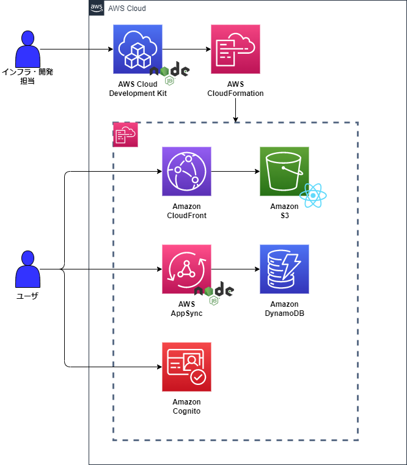

# CDK JavaScript Resolver Sample
このリポジトリは、CDKでJSリゾルバーを作成するサンプルコードです。
サンプルコードとしてCognito認証付きのToDoリストアプリを作成しました。

## 環境

**使用技術とバージョン**

| 技術 | バージョン |
| --- | --- |
| Node.js | v18.12.1 |
| CDK | 2.84.0 |
| React | 18.2.0 |

# インフラ構成図

# シーケンス図

# 参考文献
- https://docs.aws.amazon.com/cdk/api/v2/docs/aws-cdk-lib.aws_appsync-readme.html#js-functions-and-resolvers
- https://docs.aws.amazon.com/ja_jp/appsync/latest/devguide/resolver-reference-overview-js.html
- https://aws.amazon.com/jp/blogs/news/getting-started-with-javascript-resolvers-in-aws-appsync-graphql-apis/

